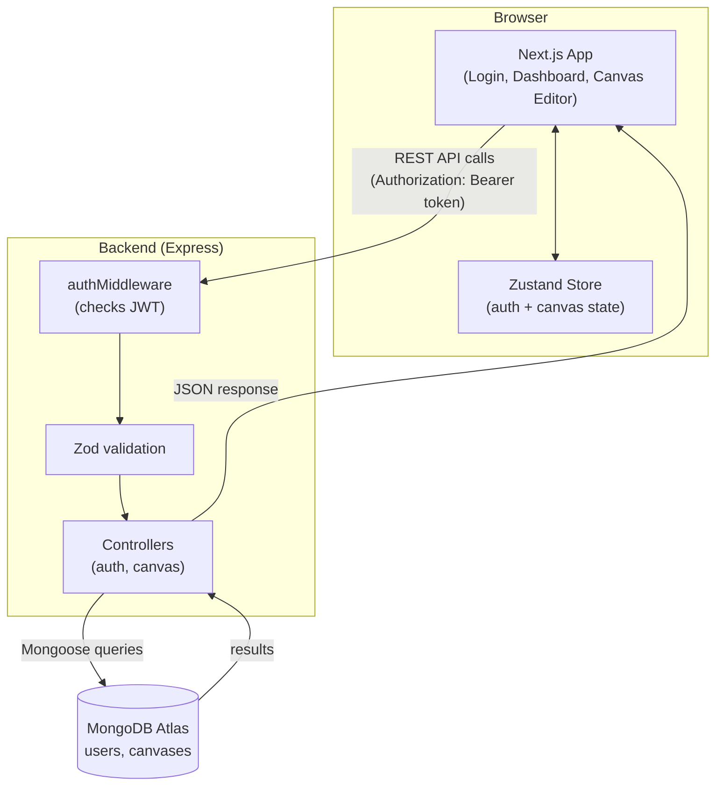

# Mini Design Canvas

A canvas editor built for the Glazia Full Stack Developer Intern assignment — create rectangles, circles, and text; select, drag, resize, and rotate them; edit their properties; and save/load canvases per user, backed by MongoDB.

**Live demo:** [add your deployed URL here]
**Repo:** [add your repo link here]

## Tech stack

**Frontend:** Next.js 14 (App Router) · React · TypeScript · React Konva / Konva · Zustand · Tailwind CSS · Framer Motion · Axios · lucide-react

**Backend:** Node.js · Express · TypeScript · MongoDB (Mongoose) · JWT (jsonwebtoken) · bcryptjs · Zod · CORS · dotenv

**Database:** MongoDB Atlas

## Project structure

```
canvas/
├── backend/     Express + TypeScript + MongoDB REST API
└── frontend/    Next.js + React + TypeScript + Konva editor
```

## Setup instructions

### Backend

```bash
cd backend
npm install
```

Create a `.env` file in `backend/` (see `.env.example` for the exact keys needed):

```
MONGODB_URI=<your MongoDB Atlas connection string>
PORT=5000
JWT_SECRET=<a long random string>
JWT_EXPIRES_IN=24h
CORS_ORIGIN=http://localhost:3000
```

```bash
npm run dev
```

Runs on `http://localhost:5000`. Health check: `GET /api/health`.

### Frontend

```bash
cd frontend
npm install
```

Create a `.env.local` file in `frontend/` (see `.env.example` for the exact keys needed):

```
NEXT_PUBLIC_API_URL=http://localhost:5000/api
```

```bash
npm run dev
```

Runs on `http://localhost:3000`. Run the backend first — the frontend depends on it for everything past the login screen.

## Dependencies

Both `backend/` and `frontend/` have their own `package.json` with exact versions, restored automatically by `npm install`. Full list of what each side uses:

**Backend (`backend/package.json`)**

| Package | Purpose |
|---|---|
| express | REST API framework |
| mongoose | MongoDB ODM |
| bcryptjs | Password hashing |
| jsonwebtoken | JWT signing/verification |
| cors | Cross-origin request handling |
| dotenv | Environment variable loading |
| morgan | Request logging |
| zod | Request body validation |
| typescript, ts-node, nodemon | Dev tooling — TypeScript compilation and auto-restart |
| @types/* | Type definitions for the above |

**Frontend (`frontend/package.json`)**

| Package | Purpose |
|---|---|
| next, react, react-dom | Core framework |
| konva, react-konva | Canvas rendering (Stage, Layer, Transformer, shapes) |
| zustand | Client-side state (canvas elements, selection, undo/redo history, auth) |
| axios | HTTP client for the backend API |
| uuid | Client-generated ids for new canvas elements |
| framer-motion | Animations (auth screens, dashboard transitions, UI micro-interactions) |
| lucide-react | Icon set used throughout the toolbar and panels |
| tailwindcss, postcss, autoprefixer | Styling |
| typescript | Type checking |
| eslint, eslint-config-next | Linting |

## Architecture diagram



**How a request flows, in plain terms:**
1. The user does something in the browser (draws a shape, clicks Save, logs in).
2. The frontend sends a request to the backend, attaching the user's login token in the request header.
3. The backend checks that token is valid before doing anything else.
4. If valid, the request is checked for correct data (validation), then handled by a controller.
5. The controller talks to MongoDB to read or write data.
6. The result goes back to the frontend, which updates what the user sees.

## Architecture decisions

Explained simply — what each choice is, and why it was made:

- **Login system (JWT):** When a user logs in, the server gives them a signed token (like a digital ID card). The frontend saves this token and sends it along with every request. The server checks the token to know who's asking and to make sure they're allowed to see or change that data. Passwords are never stored as plain text — they're hashed (scrambled in a one-way way) before saving, so even we can't read the original password.

- **Each user only sees their own canvases:** Every canvas saved in the database is tagged with the id of the user who created it. Whenever the backend fetches, updates, or deletes a canvas, it always double-checks that the canvas belongs to the person making the request — so no one can access someone else's canvas, even by guessing its ID.

- **One canvas = one database document:** Instead of storing each shape as a separate database entry, an entire canvas (its name and all its shapes) is saved as a single document in MongoDB. This is simpler and faster since a canvas is always opened, edited, and saved as one whole thing anyway.

- **Where the app "remembers" things (state):** All the shapes on the canvas, which one is selected, and other live data are kept in one central place in the frontend (a Zustand store), instead of being scattered across different components. This way, the toolbar, the canvas, and the side panels are always looking at the same up-to-date information.

- **The data controls what's drawn, not the other way around:** When you drag or resize a shape, the canvas library (Konva) moves it on screen first — but right after, we read its new position/size and save that back into our central state. That state is the "real" source of truth. This keeps things predictable and is also what makes Undo/Redo possible.

- **Undo/Redo:** Every time something changes (a shape is added, moved, resized, or deleted), the app quietly saves a snapshot of "how things looked right before that change." Pressing Undo just goes back to the last snapshot; Redo moves forward again. Up to 50 steps of history are kept.

- **Autosave:** As soon as a user creates a new canvas, it's immediately saved to the database (even if it's empty). After that, any change automatically saves itself 2 seconds after the user stops editing — so there's no need to remember to click Save.

- **Checking data before saving it (validation):** Before the backend saves anything a user sends, it checks that the data is in the right shape and format. This stops bad or broken data from ever reaching the database.

- **Editing text directly on the canvas:** Double-clicking a text box lets you type right where it is, instead of opening a separate box elsewhere on the screen — it feels more natural, like editing text in Canva or Figma.

- **Why the login token is stored in the browser's localStorage instead of a cookie:** The frontend (Vercel) and backend (Render/Railway) live on two different web addresses. Cookies get complicated and unreliable across different domains — many browsers block them by default. Storing the token in localStorage and sending it manually with each request avoids that problem entirely. The small tradeoff is explained in Known Limitations below.

## API Endpoints

| Method | Route                | Auth required | Description                                  |
|--------|-----------------------|:---:|-----------------------------------------------|
| POST   | `/api/auth/register`  | No  | Create an account, returns `{ token, user }`  |
| POST   | `/api/auth/login`     | No  | Log in, returns `{ token, user }`             |
| POST   | `/api/canvases`       | Yes | Create a canvas                                |
| GET    | `/api/canvases`       | Yes | List the current user's canvases (metadata only) |
| GET    | `/api/canvases/:id`   | Yes | Get one full canvas (including its elements)  |
| PUT    | `/api/canvases/:id`   | Yes | Update a canvas's name and/or elements        |
| DELETE | `/api/canvases/:id`   | Yes | Delete a canvas                                |

Protected routes expect `Authorization: Bearer <token>`. All canvas queries are automatically scoped to the authenticated user's `userId`.

## Bonus features implemented

- [x] Layer management/reordering — move any element forward/backward via the Layers panel
- [x] Undo/Redo — Ctrl+Z / Ctrl+Shift+Z (or Ctrl+Y), plus toolbar buttons
- [x] Autosave — debounced 2s after any change, from the moment a canvas is created
- [x] Authentication with user-owned canvases — JWT-based, canvases scoped per user
- [x] PNG export — exports the current canvas as a downloadable PNG via Konva's `toDataURL`

Beyond the assignment's bonus list, the UI also includes a custom dark/glass design system (Framer Motion transitions, animated auth screens, a profile menu, Canva-style selection handles with a custom rotate cursor) and in-place text editing directly on the canvas.

## Known limitations

- JWTs are stored in `localStorage` on the client for simplicity and cross-domain deployment compatibility. This is vulnerable to XSS in a way an httpOnly cookie wouldn't be — a production version on a single shared domain should move to cookie-based auth.
- No real-time collaboration — canvases are single-user; two people editing the same canvas simultaneously would overwrite each other's autosaves (last write wins).
- No image elements — only Rectangle, Circle, and Text are supported, per the assignment's core requirements.
- Undo/Redo history is per-session (held in memory, reset on reload) rather than persisted.
- The canvas Stage has a fixed size (900×600) rather than a resizable/infinite canvas.
